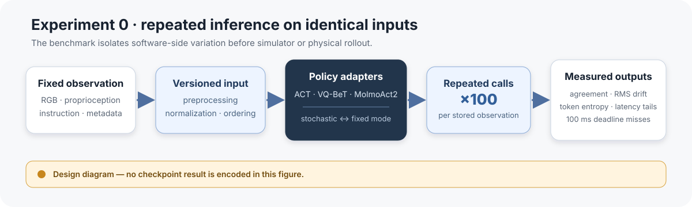
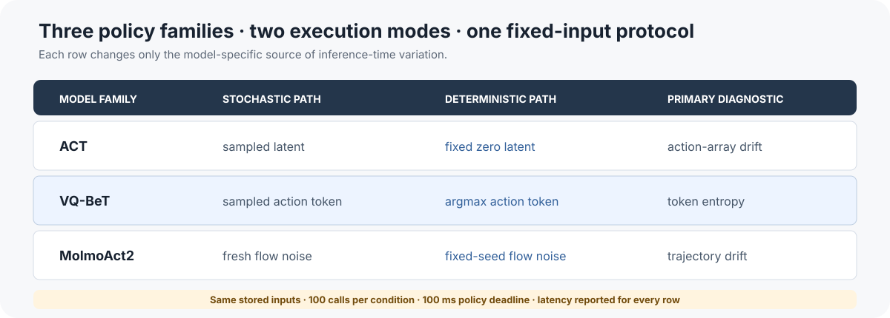

# Deterministic VLA Execution

If a robot policy sees the same observation twice, should it issue the same command twice?

This repository builds a reproducible harness for answering that question across ACT, VQ-BeT, and MolmoAct2. It isolates inference-time variation, records exactly what changes, and measures whether deterministic decoding actually produces a usable execution contract.

> **Current status:** the adapters, metrics, snapshot format, benchmark runner, training entry points, and model-independent tests are implemented. The full real-checkpoint comparison is the next experiment; lightweight stand-ins are engineering fixtures, not evidence about the original models.

*Experiment design. No checkpoint result is encoded in this figure.*

## Why repeatable inference is not enough

Model weights do not fully determine a robot's behavior. A deployed action trace also depends on:

- sampled latent variables or discrete tokens;
- flow-matching noise and numerical backend;
- observation ordering and action normalization;
- chunk length and replanning cadence;
- controller state, timing, and runtime guards; and
- changes in perception, contact, friction, or object pose.

Fixed decoding can make the software response auditable for a fixed input. It cannot—and should not—force identical physical trajectories when the world or observation history changes. The useful target is **deterministic executable semantics**: one reproducible rule for turning the same authorized inputs into the same bounded commands.

## Experiment 0

The first experiment holds each stored LIBERO-Spatial observation fixed and calls each policy 100 times in stochastic and deterministic modes.

*Explanatory condition matrix. Measured checkpoint results will be published separately after the frozen run.*

| Scale | Value |
|---|---:|
| Stored observations | 50 |
| Model families | 3 |
| Inference conditions per model | 2 |
| Calls per observation and condition | 100 |
| Policy deadline | 100 ms |
| Output artifacts | 6 JSON files + combined CSV |

The design changes one model-specific source of variation at a time:

- **ACT:** sampled latent versus fixed zero latent;
- **VQ-BeT:** sampled token versus argmax token;
- **MolmoAct2:** fresh flow noise versus fixed-seed flow noise.

## What the harness measures

| Metric | Practical question |
|---|---|
| Exact action hash agreement | Did repeated calls produce the identical action array? |
| Maximum and RMS action difference | If not identical, how large was the command drift? |
| VQ-BeT token entropy | Did discrete mode selection keep switching? |
| p50 / p95 / p99 / maximum latency | Is the common case fast, and how bad is the tail? |
| 100 ms deadline misses | Would the policy miss the planned control handoff? |

These are execution diagnostics, not task-success metrics. A policy can be perfectly deterministic and still be wrong, brittle, slow, or unsafe.

## What is implemented

- LIBERO-Spatial snapshot extraction from HDF5 demonstrations.
- A shared inference-adapter contract for ACT, VQ-BeT, and MolmoAct2.
- Stochastic and deterministic paths for every policy family.
- Token logging for VQ-BeT and fixed-noise control for MolmoAct2.
- Lightweight stand-ins that exercise adapter behavior without large downloads.
- ACT and VQ-BeT training entry points for the shared observation/action format.
- A benchmark runner that writes per-condition JSON and a combined CSV.
- Unit and integration coverage for metrics, adapters, output generation, token logging, and snapshot structure.

## What remains to run

The decisive Experiment 0 artifact requires:

1. the full LIBERO-Spatial dataset;
2. all 50 frozen snapshots;
3. pinned third-party repositories and checkpoints;
4. a recorded CUDA, PyTorch, and device environment;
5. the complete 3 × 2 × 50 × 100 inference matrix; and
6. a reviewed result table with no stand-in outputs mixed into checkpoint evidence.

No physical-robot or real-checkpoint performance result is claimed before that run completes.

## Current frontier: deterministic response rules

Recorded-input repeatability is the first gate, not the finish line. The next research stage asks whether deterministic execution remains reactive when the scene changes.

### Phase 1 — finish the checkpoint comparison

- Run the frozen 50-observation, 100-call protocol.
- Publish agreement, drift, entropy, latency tails, and deadline misses.
- Record model revision, checkpoint hash, preprocessing, normalization, backend, and seed policy.
- Plot a determinism–capability frontier only after comparable task-capability measurements exist.

### Phase 2 — add a phase-gated executor

Compare two chunk schedules:

- **fixed receding horizon:** execute a fixed prefix, then re-query;
- **predicate-bounded horizon:** end the chunk when the task phase changes, the observation becomes stale, or a verifier rejects the next command.

Then introduce two scripted changes: move the object during approach and induce one failed grasp. Measure whether each system continues stale motion, replans, retries, safely aborts, or produces an unauthorized action. Teacher-to-student transfer remains gated on a stable executor baseline.

The goal is not an identical open-loop trajectory. It is a reproducible and inspectable **response rule**.

## Repository map

~~~text
exp0/
├── adapters/             ACT, VQ-BeT, and MolmoAct2 inference adapters
├── extract_snapshots.py  fixed-input dataset preparation
├── metrics.py            agreement, drift, entropy, and latency metrics
├── run_exp0.py           repeated-inference benchmark
├── train_act.py          ACT training entry point
└── train_vqbet.py        VQ-BeT training entry point

docs/media/               explanatory experiment diagrams
setup/                    environment and third-party setup
tests/                    adapter, metric, snapshot, and harness tests
det-vla-exec-rev.md       literature review and staged research program
~~~

## Setup and reproduction

The full environment targets Linux with an NVIDIA GPU and CUDA 12.1.

~~~bash
bash setup/setup.sh
python exp0/extract_snapshots.py
~~~

Optional training entry points:

~~~bash
python exp0/train_act.py --epochs 100 --output checkpoints/act_libero.pt
python exp0/train_vqbet.py --epochs 100 --output checkpoints/vqbet_libero.pt
~~~

Run all six inference conditions:

~~~bash
python exp0/run_exp0.py \
  --act-checkpoint checkpoints/act_libero.pt \
  --vqbet-checkpoint checkpoints/vqbet_libero.pt \
  --molmoact2-checkpoint checkpoints/molmoact2_droid
~~~

Results are written to `exp0/results/` as six JSON files and `summary.csv`.

Run the model-independent suite before downloading the full dataset:

~~~bash
python -m pytest -q tests --ignore=tests/test_extract_snapshots.py
~~~

The full snapshot-format test expects all 50 generated `.npz` files.

## Scope and limitations

- The repository currently validates the harness, not the original checkpoints.
- Recorded-input repeatability does not establish task success or physical repeatability.
- The 100 ms deadline is an experiment contract, not a universal robotics requirement.
- No runtime shield, simulator perturbation result, or teacher-to-student gain is claimed yet.
- The broader staged design is documented in [det-vla-exec-rev.md](det-vla-exec-rev.md).

The project remains active because it has a clean progression: stabilize and measure model output, compile a bounded executor, then test whether deterministic policies respond correctly when the world changes.
